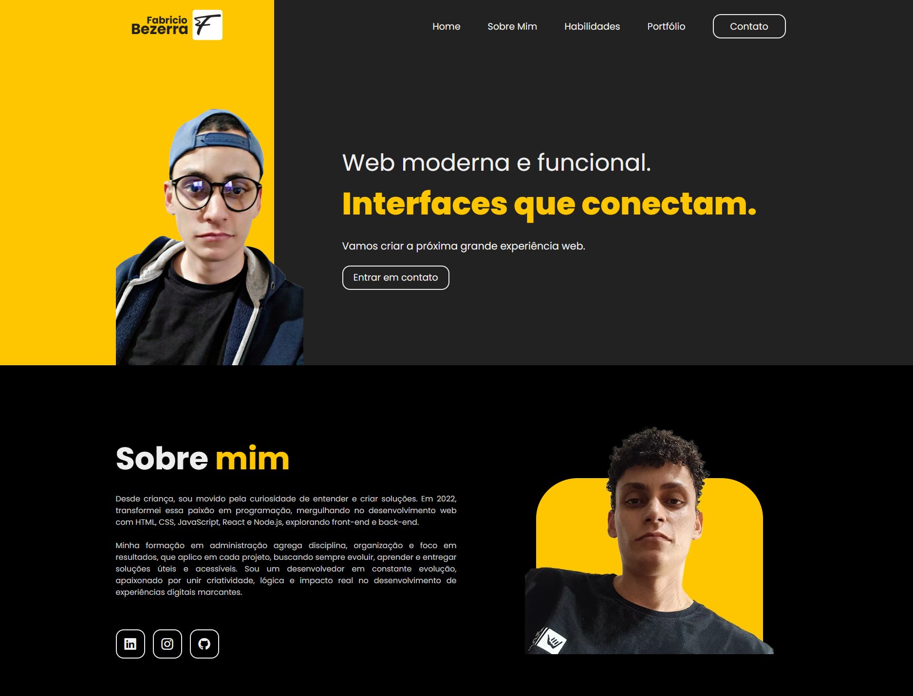

<h1 align="center"> Fabricio Bezerra | Portfólio 🗂️ </h1>

Projeto desenvolvido por <a href="https://github.com/fabriciobzrr" target="_blank">Fabricio Bezerra</a> com o propósito de criar um portfólio para postagem de projetos pessoais e também com o intuito de utilizar os conhecimentos adquiridos ao longo de sua jornada de aprendizado.

  <a href="#-tecnologias">Tecnologias</a>&nbsp;&nbsp;&nbsp;|&nbsp;&nbsp;&nbsp;
  <a href="#-projeto">Projeto</a>&nbsp;&nbsp;&nbsp;|&nbsp;&nbsp;&nbsp;
  <a href="#-layout">Layout</a>&nbsp;&nbsp;&nbsp;|&nbsp;&nbsp;&nbsp;
  <a href="#-licença">Licença</a>

  

 

  

## 🤖 Tecnologias

Esse projeto foi desenvolvido com as seguintes tecnologias:

- HTML e CSS
- JavaScript
- Git e Github

## 🛠️ Projeto

Portfólio é um projeto desenvolvido para apresentar de forma moderna e funcional minha trajetória como desenvolvedor front-end. Reúne informações pessoais, habilidades técnicas, projetos realizados e formas de contato em um só lugar. O objetivo é criar uma identidade digital clara, organizada e acessível, permitindo que qualquer pessoa conheça rapidamente quem sou, as tecnologias que domino e o tipo de experiência web que busco entregar.

## 📝 Layout

Você pode visualizar o layout do projeto através do link: [Layout Portfólio Fabricio Bezerra](https://i.ibb.co/BVbf6GHT/fabriciobezerra.png).

## 📄 Licença

Esse projeto está sob a licença MIT.

---

Desenvolvido por **Fabricio Bezerra**.  
Se desejar comentar o projeto ou propor colaborações, estou à disposição!

---

Obrigado por visitar — que este projeto inspire criatividade e evolução contínua.
